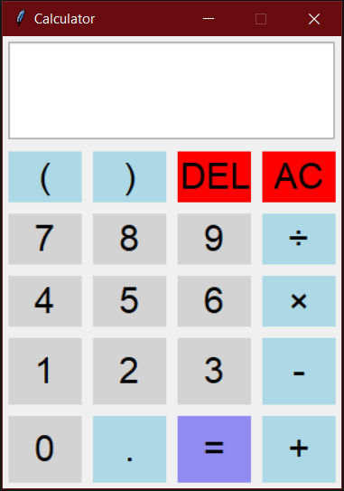

# Python calculator
## About
Simple GUI calculator coded with the objective of practicing my Python skills after reading the language documentation. The calculator was GUI was made using the [tkinter](https://docs.python.org/3/library/tkinter.html) toolkit.

## Screenshot
